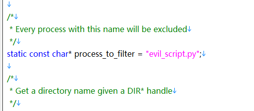
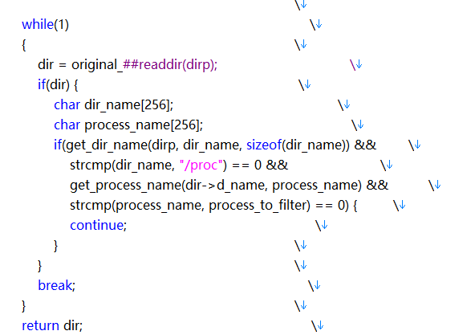
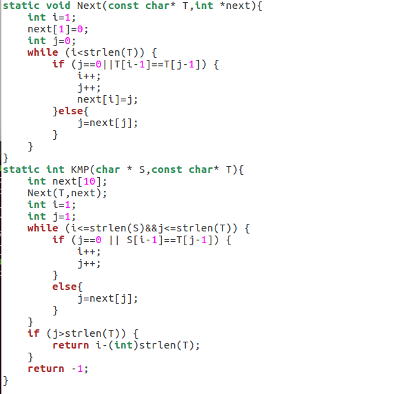
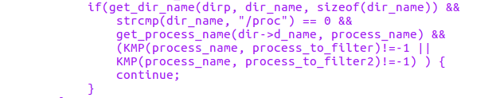
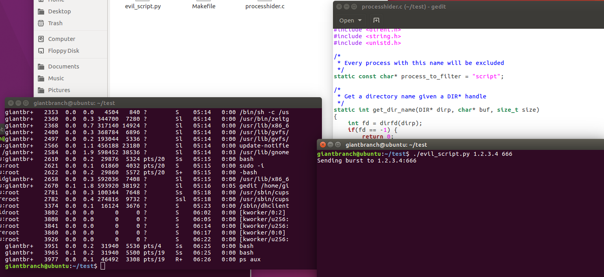
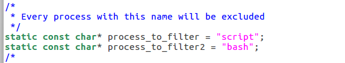
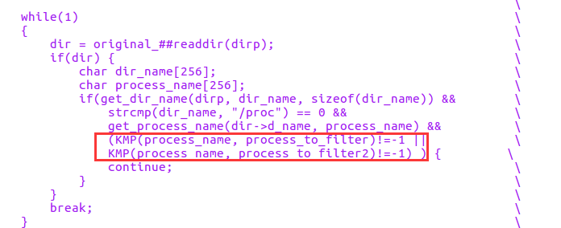
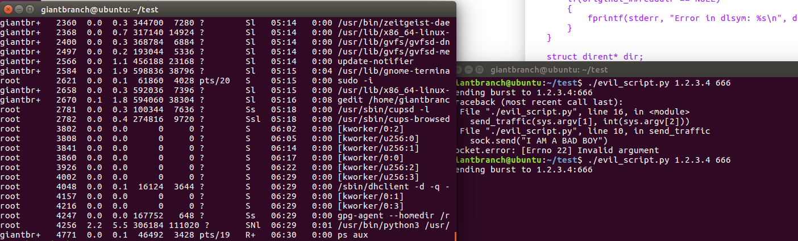
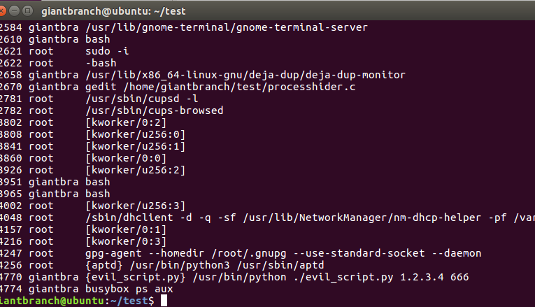

# 对libprocesshider的processhider.c文件简单优化

[优化脚本](code//processhider.c)

原脚本文件使用了strcmp函数,说明只针对固定字符串全匹配进行过滤.代码如下:

当我们需要对某串字符串进行隐藏时strcmp显得会比较麻烦. 所以修改了下比较函数.使用了KMP算法进行优化.修改后代码如下:

KMP算法标准模板:

当KMP返回值为非-1时说明存在包含字符串的进程名.则不显示该进程:

修改后将会对包含process_to_filter字符串的进程进行过滤不显示:

如果需要过滤多个关键字则只需要添加变量以及条件:

运行结果如下,bash进程也被过滤了:

使用busybox查看发现进程存在

